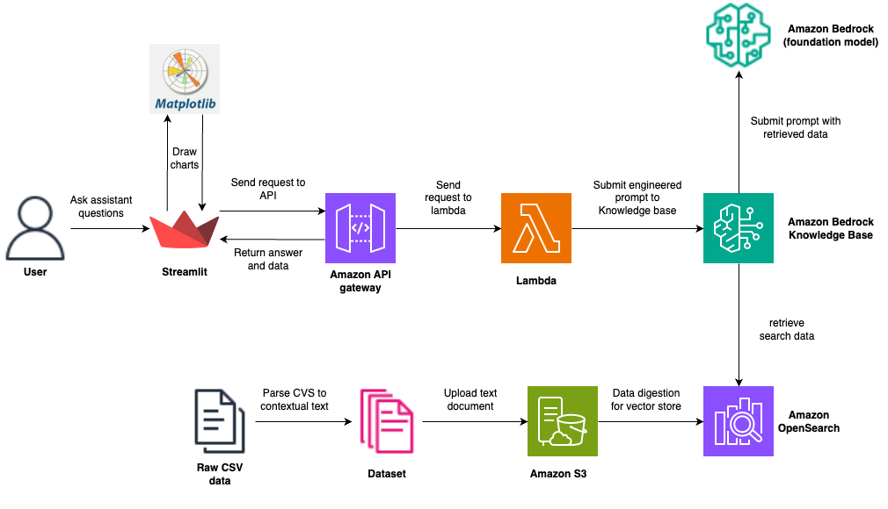

UBC CIC Gen AI and Sustainability Hackathon 2024

A key sustainability goal defined by the UN includes clean and affordable energy; industry, innovation, and infrastructure; responsible consumption and production; climate action; and sustainable cities and communities. Energy use is a major aspect of UBC operations, hosting over 60,000 students and 16,000 staff on more than 400 hectares. 

In this project we implemented retrieval augmented generation (RAG) using various AWS services to create a chatbot with a visualization feature to allow users to ask questions about energy usage at UBC. 

UBC's energy usage data is available here: https://energy.ubc.ca/projects/skyspark/

