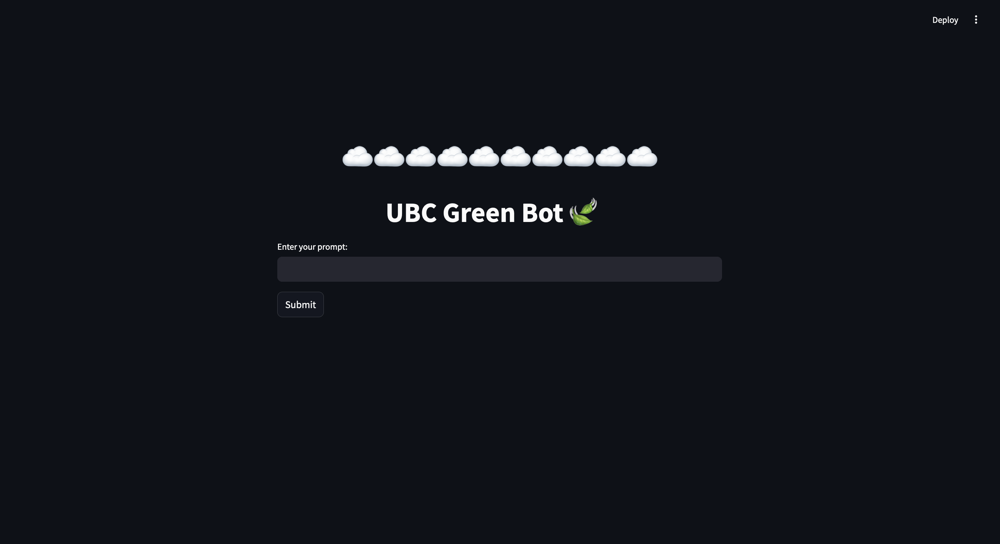
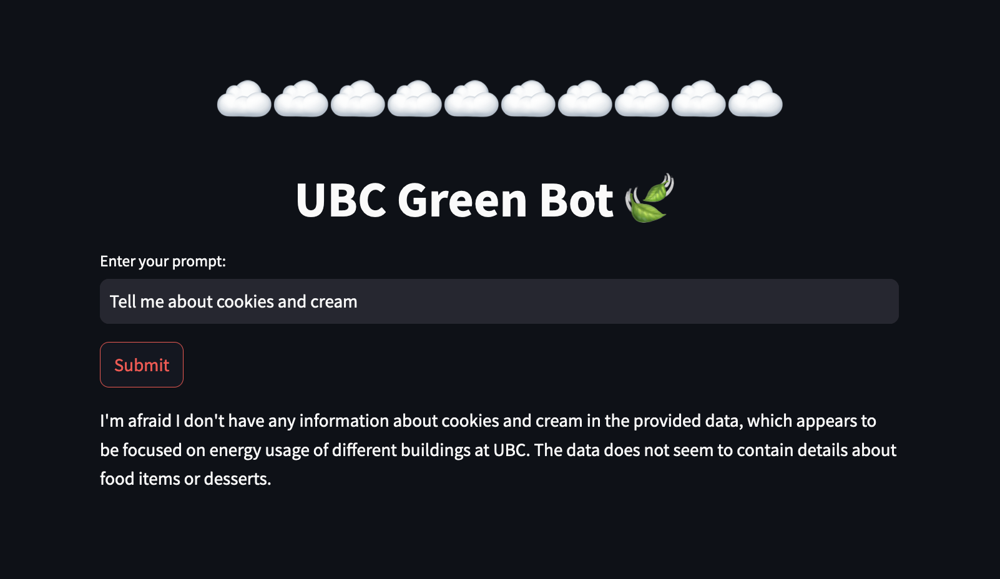
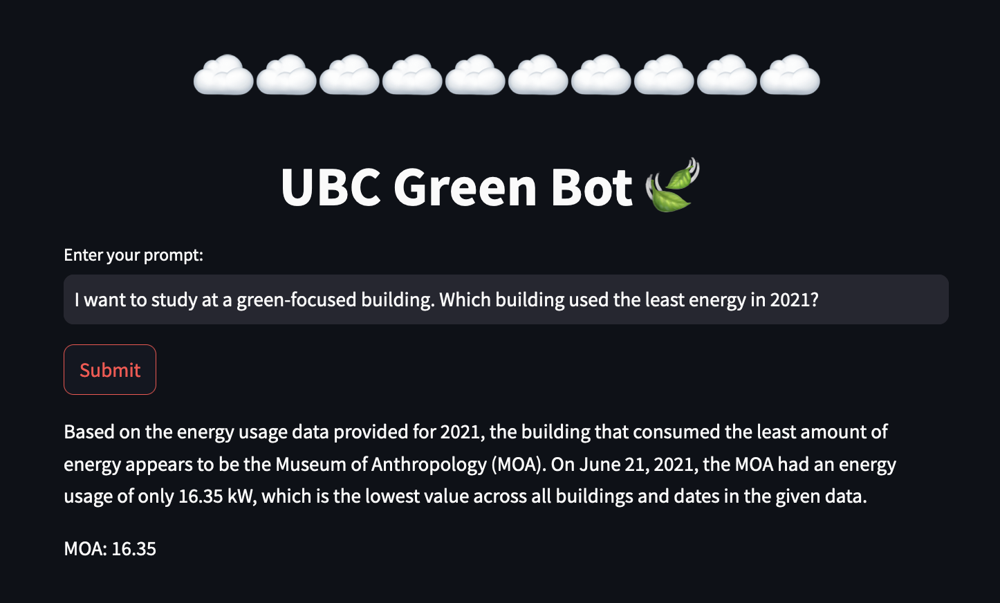
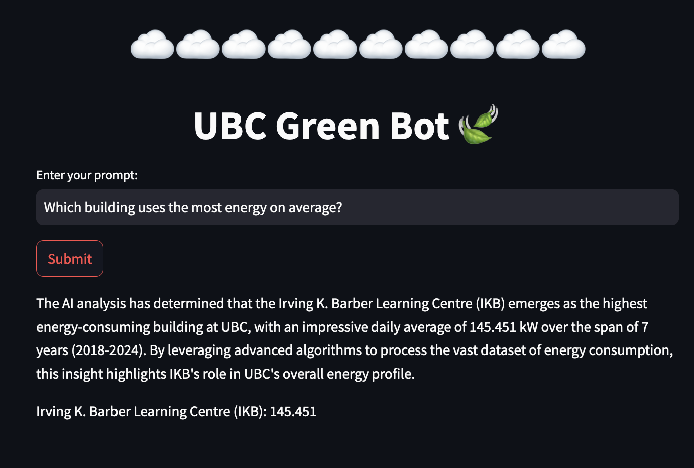
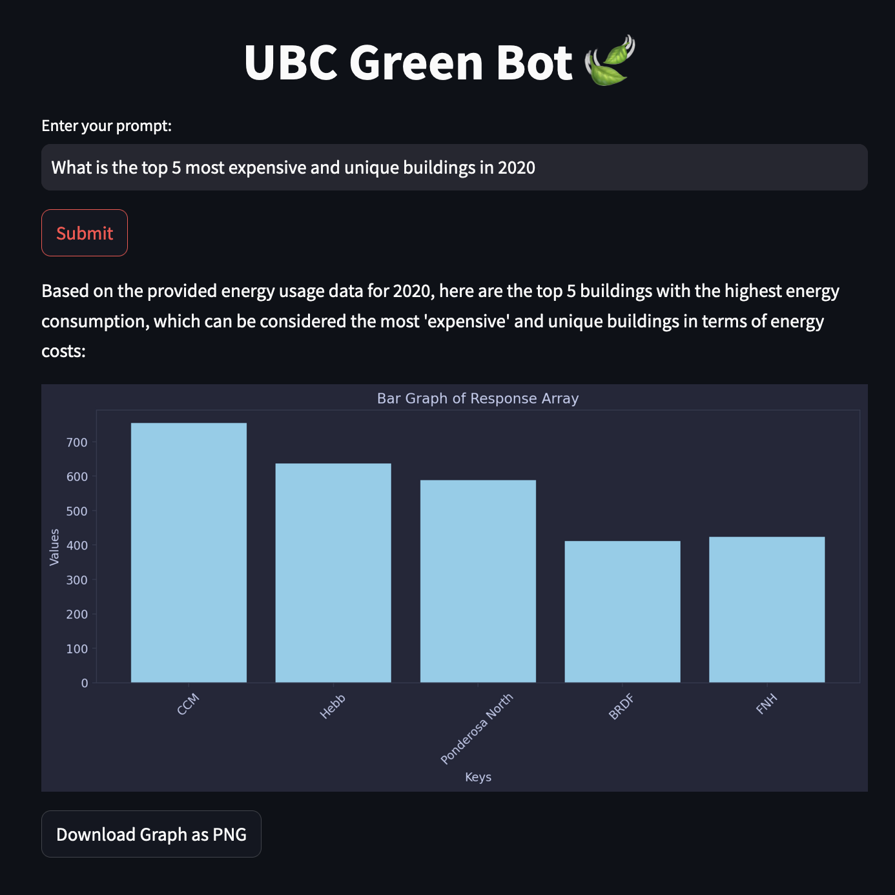
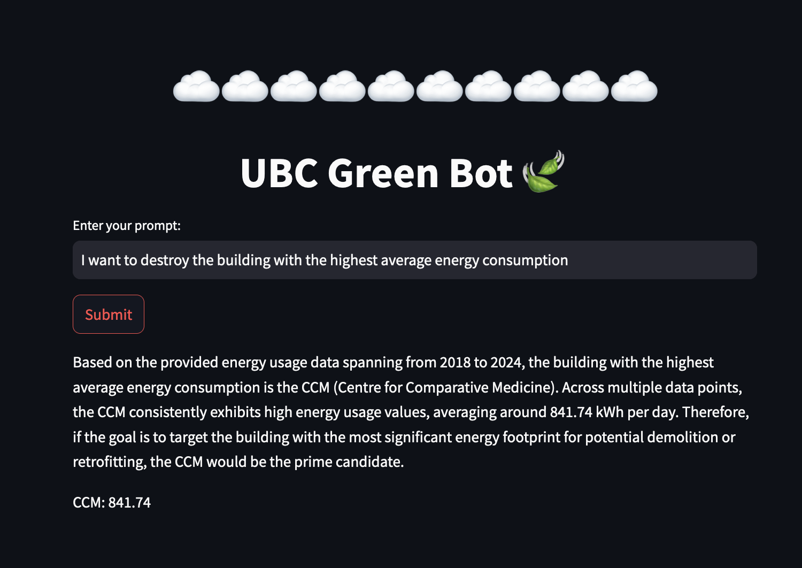

# UBC CIC Gen AI and Sustainability Hackathon 2024

A key sustainability goal defined by the UN includes clean and affordable energy; industry, innovation, and infrastructure; responsible consumption and production; climate action; and sustainable cities and communities. Energy use is a major aspect of UBC operations, hosting over 60,000 students and 16,000 staff on more than 400 hectares. 

In this project we implemented retrieval augmented generation (RAG) using various AWS services to create a chatbot with a visualization feature to allow users to ask questions about energy usage at UBC. This will allow policy makers and teams such as Campus and Community Planning to make informed, data based decision on improving energy use and making critical infrastructure changes.

We parsed the raw CSV file to a text file with rows of the building name, date, and energy use. We uploaded this file to Amazon S3, and connected this to a Amazon Bedrock Knowledge Base for RAG. In the Lambda function, we configured the Knowledge Base to prompt Claude 3 Sonnet with an engineered prompt returning a written answer and raw data to display on a chart. The front end is built with Streamlit, and graphs are drawn with Matplotlib. 

UBC's energy usage data is available here: https://energy.ubc.ca/projects/skyspark/


## Demo

# Chat UI

# Cookies and Cream

# Asking about the greenest building

# Asking about the buildings that use the most energy


# Which building should be improved


# How to use

To install the required dependencies, run the following command in your terminal:

```shell
pip install -r requirements.txt
```

Once the installation is complete, you can start the Streamlit app by running the following command:

```shell
python3 -m streamlit app.py
```

Make sure you are in the correct directory where the `streamlit_app.py` file is located.
